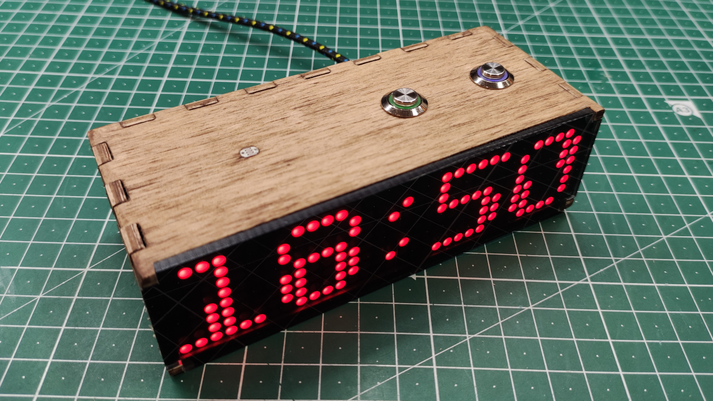

# Cronus Digital Clock



## Description

**Cronus** is a mini desktop display device.

## Motivation

Working on this project I am pursuing following goals:

- the device should be easily reproducible using widely available components and home tools;
- the project should be documented enough to be easily replicated by other people;
- the circuit, PCB and the firmware should support several kinds of displays out of the box;
- no fucking Arduino;

## About displays

One of the main ideas behind this project is to develop a single circuit and firmware which will be compatible with several kinds of
displays. Currently only one display is supported, MAX7219-based single color 32x8 dot matrix, which is widely popular among DIYers and can
be easily purchased on [AliExpress](https://www.aliexpress.com/wholesale?SearchText=max7219+matrix) or any local reseller.

## How to get source code

```shell
cd ~/src && git clone --recurse-submodules https://github.com/ashep/cronus.git
```

## How to build electronic part

Coming soon.

## Enclosure

Coming soon.

## Firmware

## Backend

Coming soon.

## Changelog

### v1.1 (never released, since fucking russian bastards started the war)

Schematic:

- Added forgotten pull-down to GPIO 15 (R8).
- Added forgotten pull-up to GPIO 2 (R8).
- NC pins of DS3231 connected to GND as its datasheet requires.

Firmware:

- Lots of bug fixes and improvements.

### v1.0 (2021-07-13)

First unstable ESP8266-based development version.
